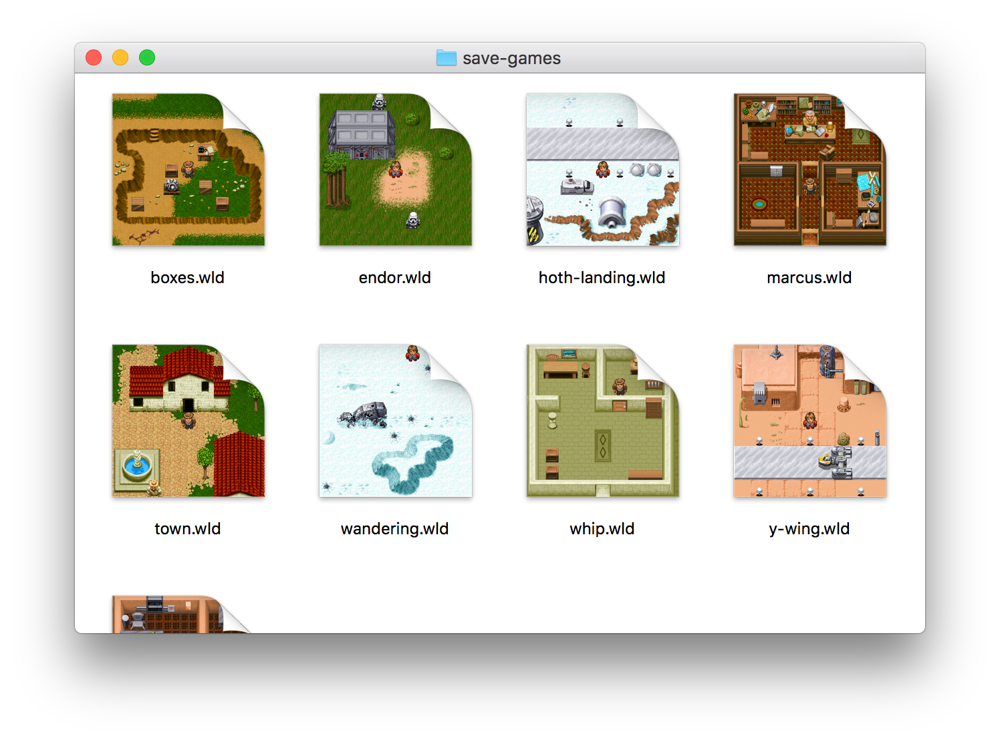

# DeskFun Preview

A command line tool and QuickLook plugin to render icons and previews for _Yoda Stories_ and _Indiana Jones and his Desktop Adventures_ save games.
The main purpose of this was to check out Rust.



## Usage

### Command Line
Check out the project and run

```sh
cd deskfun-preview
cargo run assets/save-games/*.wld
```

### QuickLook Plugin

In order to build the QuickLook plugin you have to install Rust (& Cargo) and Xcode.
With both dependencies set up you can proceed to build the project:

```bash
cd deskfun-preview
xcodebuild && xcodebuild -target "DeskFun (preview)"
```
Xcode will place the QuickLook plugin and a dummy app in `build/Release`. Launch the dummy app once to make QuickLook aware of save games and load the plugin. After that, previews should automatically show up in Finder. You can navigate to `assets/save-games` for some sample files.

## To Do

-   parse and render npcs
-   show world map in preview
-   display inventory in preview
-   use tiles from save game for rendering
